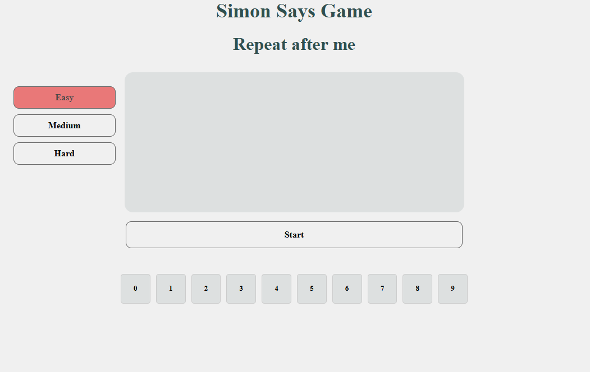

# 🎮 Simon Says Game

## 📌 Overview
**Simon Says** is a classic memory game where players must remember and reproduce sequences of keyboard symbols.

Built with **HTML, CSS, and Vanilla JavaScript**, the game supports screen sizes from **320px to 1440px**, includes **three difficulty levels**, and works with both **virtual and physical keyboards**.

---

## ✨ Features

### 🎯 Game Mechanics
- 5 rounds with increasing sequence length (**2 → 10 symbols**)
- Difficulty levels:
    - **Easy** — numbers (0–9)
    - **Medium** — letters (A–Z)
    - **Hard** — letters and numbers (A–Z, 0–9)
- New random sequence each round
- Symbols may repeat within a sequence

---

### ⌨️ Input Support
- Virtual on-screen keyboard
- Physical keyboard input with visual highlighting
- Single key processing

---

### 🔄 Game Flow
- Automatic input validation
- One **Repeat sequence** per round
- Immediate feedback for correct / incorrect input
- Game over after two mistakes in the same round
- **New Game** available at any time (except during sequence playback)

---

## 🛠 Tech Stack
- HTML5, CSS3 (Flexbox / Grid)
- Vanilla JavaScript (ES6+)
- Dynamic DOM creation via `createElement()`
- Event-driven architecture
- Responsive design

---

## ▶️ Running the Project

1. `git clone https://github.com/blk-thorn/simon-says.git`
2. Open index.html in your browser (no build tools or dependencies required).

## 🎮 How to Play

1. Select difficulty
2. Click Start
3. Watch the sequence
4. Repeat it using mouse or keyboard
5. Complete all 5 rounds to win

---

## 📸 Preview

